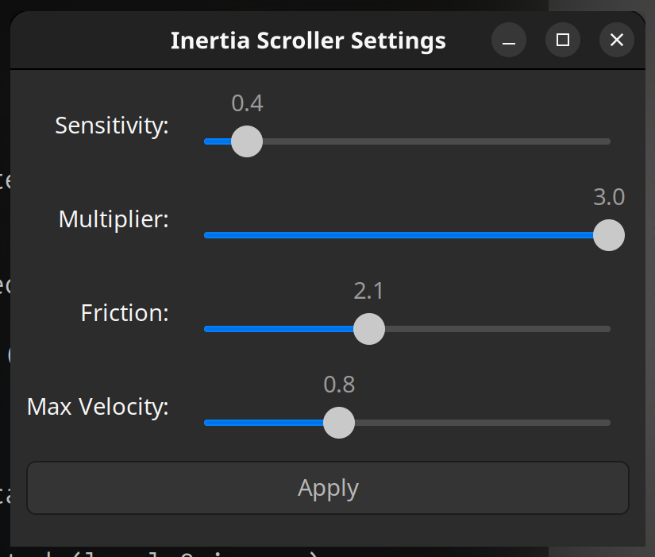

# momentum mouse

## Introduction

momentum mouse brings smooth, natural scrolling to Linux desktop environments. It transforms the abrupt, jerky scrolling experience typical of mouse wheels into a fluid, momentum-based scrolling experience similar to what you'd find on modern trackpads and touchscreens.


## The Problem

Scrolling with a mouse on Linux can be a jarring experience. Each notch of the scroll wheel produces a fixed-distance jump that:

- Hurts your eyes as content suddenly jumps instead of flowing
- Makes it difficult to track where you are in a document
- Creates a disconnected feeling between your input and the on-screen response
- Lacks the natural physics-based movement we've come to expect from modern interfaces
- Makes reading long documents more tiring than it needs to be

## The Solution

momentum mouse solves this by:

1. Intercepting your mouse's scroll wheel events
2. Applying physics-based inertia and momentum calculations
3. Emulating natural touchpad gestures to produce smooth scrolling

Instead of content jumping in fixed increments, it glides naturally with momentum, gradually slowing down just like a physical object would. This creates a more intuitive, comfortable, and visually pleasing scrolling experience. Kinematic scrolling in Ubuntu is finally here!

### Demos

<video src="https://github.com/user-attachments/assets/d42a480c-b53e-4cd7-b151-461f03fb3ea0"></video>

<video src="https://github.com/user-attachments/assets/cb221dfb-f96d-47ca-9db2-61940c18c867"></video>

## Features

- **Smooth Inertial Scrolling**: Content continues to move after you stop scrolling, gradually slowing down
- **Natural Scrolling Option**: Choose between traditional or natural (touchpad-like) scrolling direction
- **Horizontal Scrolling Support**: Works with both vertical and horizontal scrolling
- **Configurable Physics**: Adjust sensitivity, friction, and velocity to match your preferences
- **System Integration**: Runs as a background service with minimal resource usage
- **Auto-detection**: Automatically detects your system's scroll direction settings

## Usage

- Use your scroll wheel like you normally would!
- Click to stop the inertia
- Move your mouse to dampen the inertia

## Installation

### From Debian Package (.deb)

```bash
# Download the latest .deb package
wget https://github.com/AshMartian/momentum_mouse/releases/latest/download/momentum-mouse_0.3.0_amd64.deb

# Install the package
sudo dpkg -i momentum-mouse_0.3.0_amd64.deb

# Install dependencies if needed
sudo apt-get install -f

# The service will start automatically
```

### Building from Source

```bash

# Clone the repository
git clone https://github.com/AshMartian/momentum_mouse.git
cd momentum-mouse

# Install dependencies
./setup.sh

# Build the project
make

sudo ./momentum_mouse -h

# Install (optional)
sudo make install

# Start the service
sudo systemctl start momentum_mouse.service
```

## Configuration

momentum mouse can be configured through:

1. Command-line arguments
2. Configuration files at `/etc/momentum_mouse.conf` (system-wide)
3. Via the GUI! Installed as "momentum mouse Settings"



### Configuration File Reference

```
# Enable or disable multitouch scrolling (true/false or 1/0)
multitouch=true

# Grab the input device exclusively (true/false or 1/0)
grab=false

# Use natural scrolling direction (true/false or 1/0)
natural=false

# Use horizontal scrolling instead of vertical (true/false or 1/0)
horizontal=false

# Enable debug logging (true/false or 1/0)
debug=false

# Scroll sensitivity (default: 1.0)
sensitivity=1.0

# Scroll multiplier (default: 1.0)
multiplier=1.0

# Scroll friction (default: 2.0)
friction=2.0

# Maximum velocity factor (default: 0.8)
max_velocity=0.8
```

After updating your configuration, run `sudo systemctl restart momentum_mouse.service`

### Command Line Usage

```
momentum mouse - Smooth scrolling for Linux

Usage: momentum_mouse [OPTIONS] [DEVICE_PATH]

Options:
  --help, -h                  Show this help message and exit
  --debug                     Enable debug logging
  --grab                      Grab the input device exclusively
  --no-multitouch             Use wheel events instead of multitouch
  --natural                   Force natural scrolling direction
  --traditional               Force traditional scrolling direction
  --horizontal                Use horizontal scrolling instead of vertical
  --no-auto-detect            Don't auto-detect system scroll direction
  --sensitivity=VALUE         Set scroll sensitivity (default: 1.0)
  --multiplier=VALUE          Set repeating scroll multiplier (default: 1.0)
  --friction=VALUE            Set scroll friction (default: 1.0)
                              Lower values make scrolling last longer
  --max-velocity=VALUE        Set maximum velocity as screen factor (default: 0.8)
                              Higher values allow faster scrolling
  --daemon                    Run as a background daemon

If DEVICE_PATH is provided, use that input device instead of auto-detecting
```

## Troubleshooting

### Common Issues

1. **No effect on scrolling**: Make sure the service is running with `systemctl status momentum_mouse.service`
2. **Wrong mouse detected**: Specify your mouse device path directly with `momentum_mouse /dev/input/eventX`
   - Check available input devices with `evtest`
3. **Conflicts with other software**: Try disabling the `--grab` option if other applications need access to your mouse

### Logs

Check the system logs for troubleshooting:

```bash
journalctl -u momentum_mouse.service
```

### Disable

Don't like it? Sorry, run `sudo systemctl stop momentum_mouse.service` :(

## Contributing

Contributions are welcome! Please feel free to submit a Pull Request.

## License

This project is licensed under the MIT License - see the LICENSE file for details.
